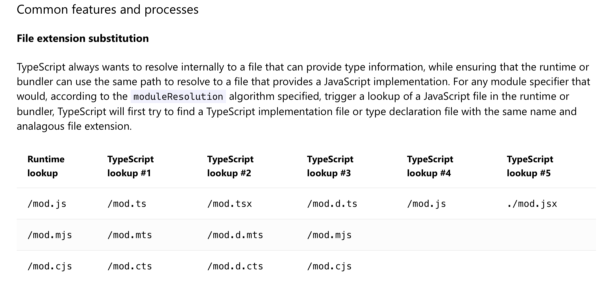
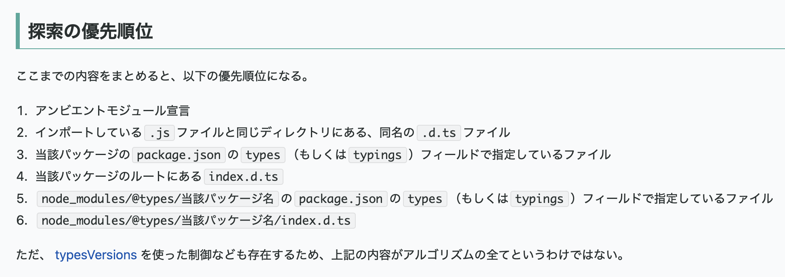

### .d が名前につくファイルの存在

- 型定義ファイルを指す

    - 複数ファイルで利用したいデータ型を記述するファイル

    <br>

    - ★わかりやすくいうと **JavaScript のコードに型情報を与えるためのファイル**

    <br>

    - `~~.d.ts` ファイルがあるということはそのファイルに定義されている型情報を利用した実装がどこかにあるよと伝えている

    <br>

    - 主に JavaScript ライブラリを TypeScript で使うために利用されている

        - TypeScript ファイルから JavaScript ファイルを import で読み取ることができる

        <br>

        - 外部パッケージはたとえ TypeScript で元々は書かれていたとしても、インストール先で Node.js があれば動くように JavaScript にコンパイルされたものが配布される

        <br>

        - すると、以下のような問題が発生する

            - ★★自分の TypeScript プロジェクトで外部パッケージ A を利用しようとしたところ、**A が提供しているクラスなどの型情報がわからない**
            
            <br>

            - 型情報ファイルが存在することによって、利用しようとしている外部パッケージのインスタンスなどの型情報がわかるようになるため補完が効くし、静的チェックも効くようになる

        <br>    

        

<br>
<br>

参考サイト

[.d.tsファイルをちゃんと使うために必要な知識](https://zenn.dev/uhyo/articles/use-d-ts-correctly#.d.tsファイルのよくない使い方)

[`*.d.ts` ファイルをコミットする前に知ってほしい4つのこと](https://zenn.dev/qnighy/articles/9a6a0041f2a1aa)

[型ファイルに.d.tsファイルを使うべきか](https://dev.classmethod.jp/articles/typescript-d-ts/)

[【TypeScript_15】 型定義ファイル（.d.ts）って何？](https://note.com/happy_avocet7237/n/n744b5992d8fe)

---

### d.ts ファイルを理解するために

- d.ts ファイルの中は型の**定義のみ記述可能**で、実装はできない

    ```ts
    //types.d.ts

    //OK
    declare function greet(name: string): string

    //OK
    export class Counter{
        countNum: number;
        constructor(initNum: number);
        countUp(): string; 
        countDown(): string; 
    }

    //NG
    declare function greet(name: string): string {
        retrun `Hello ${name}`;
    }
    
    //NG
    export class Counter{
        countNum: number;

        constructor(initNum: number) {
            this.countNum = initNum;
        }

        countUp(): string {
            return this.countNum++;
        }

        countDown(): string {
            return this.countNum--;
        }
    }
    ```

<br>

#### 型情報ファイル (d.ts) 中でよく使われるキーワード

- ##### declare

    - 別名「アンビエント宣言 (ambient declaration)」

    <br>

    - ★declare だけで記述された型情報ファイル (\~\~.d.ts) は**スクリプトファイルとして認識される**

        - 従って、スクリプトファイルのトップレベルで declare で定義された型情報はグローバルスコープになる

            - たとえば以下のようにコンパイル済みの js ファイルがあるとする

                ```js
                //my-lib.js
                export function greet(name) {
                    return `Hello ${name}`
                }
                ```

            <br>

            - my-lib.js の型情報を my-lib.d.ts に `declare` で宣言する

                ```ts
                //my-lib.d.ts
                declare function greet(name: string): string;
                ```

            <br>

            - my-lib.d.ts に記述されている型情報はグローバルスコープなので、どのファイルからも import なしで参照できる

                ```ts
                //index.ts

                //↓は引数のデータ型が合っていないのでエラー
                const result: string = greet(1);

                //↓は戻り値のデータ型が合っていないのでエラー
                const result: number = greet("andy");

                //↓はOK
                const result: string = greet("andy");
                ```

<br>

- ##### export

    - 普通に ES Moudle でよく使われる export キーワード 

    <br>

    - ★export がある型情報ファイル (d.ts) はモジュールとして扱われるので、そのファイル内で定義されている型情報はモジュールスコープになる

        - 従って、その型情報を参照するには import で読み取る必要がある

            - たとえば以下のようにコンパイル済みの js ファイルがあるとする

                ```js
                //my-lib.js
                export function greet(name) {
                    return `Hello ${name}`
                }
                ```

            <br>

            - my-lib.js の型情報を my-lib.d.ts に `export` 付きで宣言する

                ```ts
                //my-lib.d.ts
                export function greet(name: string): string;
                ```

            <br>

            - my-lib.d.ts に記述されている型情報はモジュールスコープなので、どのファイルからも参照する際は import する必要がある


                ```ts
                //index.ts
                import { greet } from "./my-lib"

                //↓は引数のデータ型が合っていないのでエラー
                const result: string = greet(1);

                //↓は戻り値のデータ型が合っていないのでエラー
                const result: number = greet("andy");

                //↓はOK
                const result: string = greet("andy");
                ```

    <br>

    - ★型情報ファイルを import する際に**基本的には**拡張子はつけてはいけない 
    
    <br>

    - ★★Q: index.ts で import しているのは my-lib.js? それとも my-lib.d.ts?

        - A: 実行時には my-lib.js, コンパイル時は my-lib.d.ts

            - ★★★つまり、js ファイルとその型情報である d.ts ファイルは**基本的**に同階層に配置しないといけない (pakcgae.jsonのtypesフィールドなどを利用すればその限りではない)

        

        引用: [Modules - Reference Common features and processes](https://www.typescriptlang.org/docs/handbook/modules/reference.html?utm_source=chatgpt.com#common-features-and-processes)

<br>
<br>

参考サイト

[型定義ファイル (.d.ts)](https://typescriptbook.jp/reference/declaration-file)

[Modules - Reference Common features and processes](https://www.typescriptlang.org/docs/handbook/modules/reference.html?utm_source=chatgpt.com#common-features-and-processes)

---

### d.ts ファイルを生成する方法

- 作成した ts ファイルの型情報をわざわざ手書きで作成しなくても、`tsc -d` コマンド実行することで自動で型定義ファイルを作成してくれる

    ```bash
    npx tsc -d

    #任意のファイルを指定してもOK
    npx tsc -d src/foo.ts
    ```

<br>

- tsconfig.json で `emitDeclarationOnly` オプションを true にすれば `tsc` コマンドで -d オプションをつけなくとも型ファイルを出力してくれるようになる

    - ★`declaration` か `composite` オプションを有効にしないと `emitDeclarationOnly` を有効にできないことに注意

        ```json
        {
            "compilerOptions": {
                "target": "esnext",
                "moduleResolution": "node",
                "declaration": true, //emitDeclarationOnlyを設定するために、declarationを有効にしている
                "emitDeclarationOnly": true,
            }
        }
        ```

<br>
<br>

参考サイト

[サバイバルTypeScript - 型定義ファイル出力例](https://typescriptbook.jp/reference/declaration-file#型定義ファイル出力例)

[型定義ファイル（d.ts）ファイルのみ出力する](https://nju33.com/notes/typescript/articles/型定義ファイル（d.ts）ファイルのみ出力する#型定義ファイル（d.ts）ファイルのみ出力する)

[tsc: 型定義ファイル .d.ts の出力設定を行う](https://zenn.dev/key_luvless/books/54b91f977edf05/viewer/e6e7cc)

---

### d.ts ファイルの必要性

- ★自分のプロジェクト内のみで作成し、利用する自作のモジュールの**型情報ファイルは作成する必要はない**

- 外部に公開するパッケージを作成する場合は、そのパッケージ独自の型情報のファイルは作成するべき

---

### 型定義ファイルが読み込まれる仕組み


- 基本的に以下の順で型情報が探索される

    

    引用: [TypeScript の型定義ファイルの探索アルゴリズム](https://numb86-tech.hatenablog.com/entry/2020/07/15/153431)

<br>

- しかし、型定義ファイルがスクリプトかモジュールかそれとも混合かによって微妙に違ってくる

    - `プロジェクト/型定義ファイル`、`node_modules/<パッケージ>/型定義ファイル`、`node_modules/@types/<パッケージ>/型定義ファイル` が存在し、全て[モジュール](#export)定義ファイルの場合は **`node_modules/<パッケージ>/型定義ファイル`** が採用される

        

    <br>

    - `プロジェクト/型定義ファイル`、`node_modules/<パッケージ>/型定義ファイル`、`node_modules/@types/<パッケージ>/型定義ファイル` が存在し、全て[スクリプト](#declare)定義ファイルの場合は **`node_modules/<パッケージ>/型定義ファイル`以外の型定義がマージされる**

        
    
    <br>

    - 利用するファイルにて `import { ~ } from "<パッケージ>"` で変数/オブジェクト/関数などを利用する場合 `node_modules/<パッケージ>/型定義(モジュール)` → `node_modules/@types/<パッケージ>/型定義(モジュール)` の順で探索され、**スクリプトの型情報は無視される**
        
        

        <br>

        - 一方で、利用するファイルにてグローバル変数/グローバルオブジェクト/グローバル関数を呼び出す場合......そもそも node_modules 配下のパッケージのグローバルは簡単には呼び出せない

            

<br>

#### 重要なポイント

- node_modules/@types/<パッケージ名>/型定義ファイル は暗黙的に読み込まれる (node_modules/<パッケージ名> に型情報ファイルがあれば、それが優先される)

<br>

- ★node_modules/<パッケージ名>/型定義ファイル が**スクリプトの場合**、 利用側が `import { ~ } from "<パッケージ名>"` でモジュールを読み込む時は無視される

    

<br>
<br>

参考サイト

[TypeScript の型定義ファイルの探索アルゴリズム](https://numb86-tech.hatenablog.com/entry/2020/07/15/153431)

[【TypeScript】型定義ファイルをちゃんと理解したい](https://qiita.com/kts64/items/f34b7ee999bab6bd6178#型定義を拡張する)