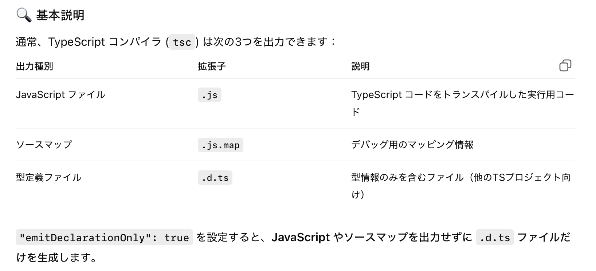

### allowImportingTsExtensions とは

- TypeScript 5.0 で導入された機能

<br>

- ★その名の通り、import の対象に `.ts, .mts, .cts, .tsx` 拡張子を書くことができる設定項目

    - allowImportingTsExtensions を有効にしないと、import の対象として `.ts, .mts, .cts, .tsx` を指定することはできない (詳しくは[こちら](./tsconfig_moduleResolution.md#疑問1)を参照)

    

<br>

- しかし、allowImportingTsExtensions を有効にするといくつかの[制約](#allowimportingtsextensions-の制約)も発生することに注意

<br>
<br>

参考サイト

[TypeScript4.5以降で追加されたTSConfigのオプションを調べてみた](https://t-yng.jp/post/typescript-tsconfig-options-over-4.5)

---

### allowImportingTsExtensions の制約

- ★allowImportingTsExtensions を有効にする場合 noEmit か emitDeclarationOnly も有効 (true) になっている必要がある

    ```json
    //tsconfig.json
    {
        "compileOptions": {
            "allowImportingTsExtensions": true,
            //少なくとも以下のどちらかをtrueにする必要がある
            "noEmit": true,
            "emitDeclarationOnly": true
        }
    }
    ```

    - noEmit とは

        - tsc コンパイルを実行しても、コンパイル結果を出力しないようにするオプション = tsc による型チェックのみを行いたい時によく使われる機能

    <br>

    - emitDeclarationOnly とは

        - [型定義ファイル(.d.ts)](./dファイルとは.md) のみを出力する機能

            

    <br>

    - ★★そもそもなぜ↑を有効にしないといけないのか?

        - allowImportingTsExtensions とは、**import の対象のファイル拡張子に .ts (.mts, .cts, .tsx) を許容するだけ**で、コンパイル時に .js などの対応する拡張子に変換することはしない

            - よって、allowImportingTsExtensions で許容された .ts を対象とする import 文が書かれたファイルがコンパイルされた場合、実行時にはエラーが発生する

                ↑のような実行時エラーを防ぐため、実行可能な .js ファイルを出力させないように noEmit や emitDeclarationOnly を強制するようになっている

            

<br>

- ★[rewriteRelativeImportExtensions](./tsconfig_rewriteRelativeImportExtensions.md) が有効になっていても OK

    - rewriteRelativeImportExtensions を有効にする場合、noEmit や emitDeclarationOnly は有効にしなくてもいい