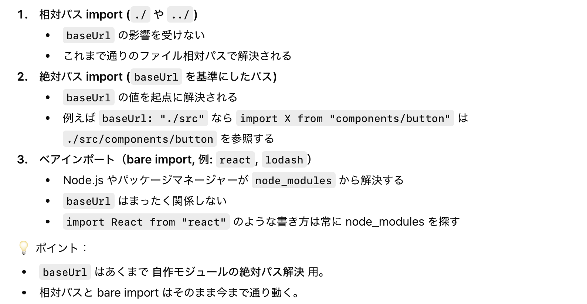

### tsconfig.json の baseUrl フィールド

- baseUrl は「絶対パスでのモジュール解決の基準」を設定する項目

    

     

    - こちらの[記事](https://zenn.dev/hayato94087/articles/198646f23bc841)がわかりやすい

 

- ★baseUrl の影響を受けるのは絶対パスのみ

    

 

- paths フィールドと組み合わせることで、paths フィールドで指定するディレクトリが baseUrl になる

    

 
 

参考サイト

[tsconfig.json の baseUrl](https://zenn.dev/hayato94087/articles/198646f23bc841)

---

### 注意点

- baseUrl はコンパイルを通すためだけの設定であり、コンパイル時に import 文を書き直してくれるものではないことに注意

    

 

- ↑の実行時エラーを防ぐにはにはモジュールバンドラーやビルドツールなどで baseUrl, paths を利用したパスの指定を解決するしかない

    - [paths の解決方法](./tsconfig_paths.md#paths-で指定したエイリアスの解決) と同じ方法で解決できる

 

#### Vite + TypeScript で baseUrl だけを使う場合

- [vite プラグインを使う](./tsconfig_paths.md#vite-プラグイン-vite-tsconfig-paths-を使う方法)のが一番楽

- vite.config.js の resolve.alias でも以下のように解決できる

    

     

    - ★そもそも baseUrl だけを指定するというケースをそもそも避けた方がいい。。。

 
 

参考サイト

[NodeJSでtsconfigのbaseUrlを設定する際にハマったこと](https://qiita.com/ryosuke_1234/items/cb75a0518d9dec69c556)