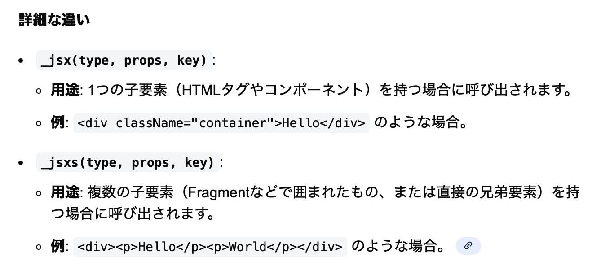

### tsconfig.json の jsx フィールド

- TypeScript コンパイラが jsx/tsx をどのように変換するかを設定する項目

 

- ★jsx フィールドはデフォルト値を持たない

    - jsx フィールドが明示的に指定されていない場合、jsx/tsx のコンパイルでエラーが起きる

 

- jsx フィールドに設定できる値は以下の5つ

    - #### `react`

        - React17 より前の React で動かしたい場合に選択する値

        - jsx/tsx 中のタグは `React.createElement()` に変換される

            

     

    - #### `react-jsx`

        - React17 からの React で動かしたい場合に選択する値

        - jsx/tsx 中のタグは `_jsx()`, `_jsxs()` に変換される

            

         

        - ちなみに `_jsx()`, `_jsxs()` の違いは以下の通り

            

     
    
    - #### `react-jsxdev`

        - 基本的には [react-jsx](#react-jsx) と同じく react17 以降の React で動かしたい時に選択する値

            - ★しかし、jsx/tsx 中のタグは `_jsx()`, `_jsxs()` に変換されるのではなく、`jsxDEV()` に変換される

            - `jsxDEV()` はデバッグ用の情報を持つことができ、開発ビルドで参照することができる

                

         

        - `react-scripts start`: 開発ビルド

            - `jsxDEV()` に追加されたデバック情報が参照可能

         

        - `react-scripts build`: 本番ビルド

            - ★コード中の `jsxDEV()` は `_jsx()`, `_jsxs()` に変換される + `jsxDEV()` にあるデバック上情報は取り除かれ　バンドルされる

            - ★よって、ビルド結果は `react-jsx` と変わらない

            

     

    - #### `preserve`

        - 型チェックはするが変換はしない

        - ファイル拡張子も .jsx/tsx のまま出力

        - tsc の後の Babel や SWC、esbuild、Vite などが JSX をトランスパイルするようなケースで使う値

     

    - #### `react-native`

        - 型チェックはするが変換はしない

        - ★ファイル拡張子は .js に変換

        - ReactNative を使う場合に選択される値

 
 

参考サイト

[サバイバルTypeScript - JSXとコンパイル](https://typescriptbook.jp/reference/jsx#jsxとコンパイル)

[【TypeScript】tsconfig.jsonの設定 - compilerOptions](https://qiita.com/crml1206/items/8fbfbecc0b40968bfc42#compileroptions)

[React17におけるJSXの新しい変換を理解する](https://zenn.dev/uhyo/articles/react17-new-jsx-transform)

[TypeScript - jsx](https://www.typescriptlang.org/ja/tsconfig/#jsx)