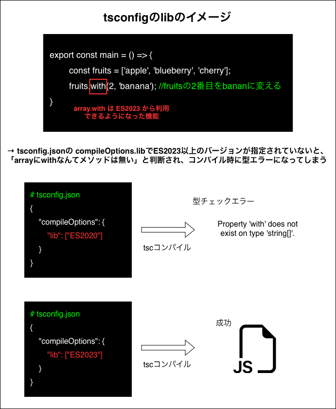
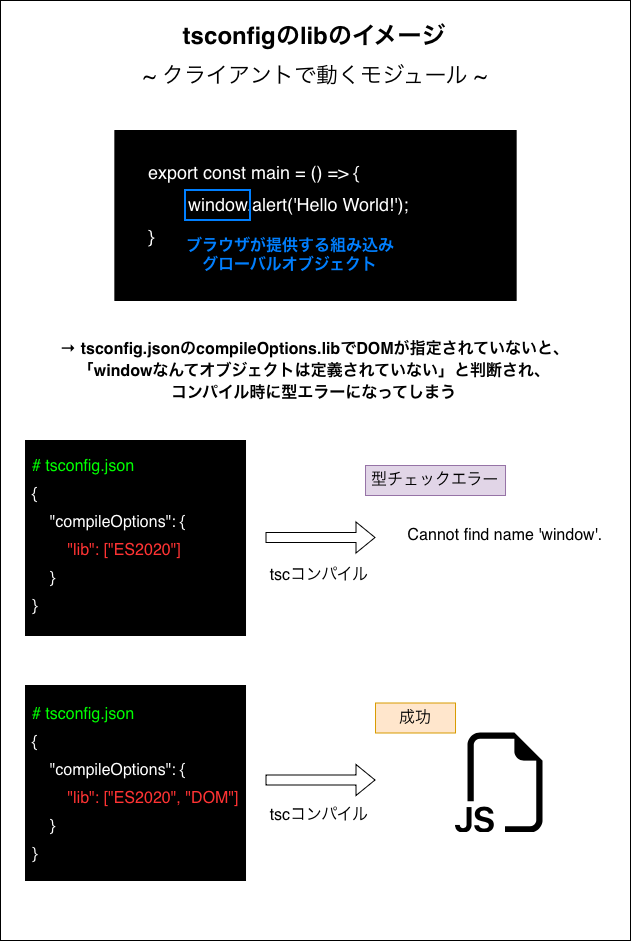
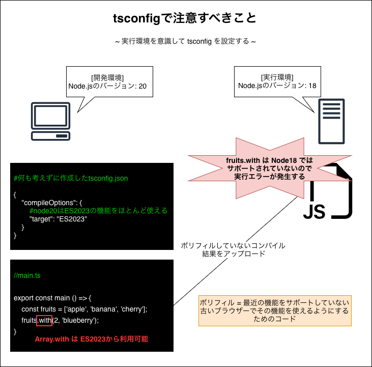

### tsconfig の lib フィールドとは

-  ざっくり説明すると、**このプロジェクトでは どんな環境のビルトインオブジェクトの型情報が使えるのか** を設定する項目

    

     

    - ★`lib` フィールドはあくまで型チェックに関する項目であり、コンパイル結果には何も影響を及ぼさない

        - 出力結果に影響があるのは `target` フィールド

 

- クライアントで動くモジュールを作成する場合は lib フィールドに DOM も必要

    

 

- ★tscofnig で lib フィールドを明示的に指定しない場合、**target フィールドと同じ ES バージョン + DOM** が裏で自動で設定される

    

 

- ★tscofnig で lib フィールドを明示的に指定する場合、指定された API 以外の型情報は参照できなくなる

    

 
 

参考サイト

[tsconfig.jsonの主要オプションを理解する - lib](https://qiita.com/ryokkkke/items/390647a7c26933940470#lib)

[tsconfig.json とは？](https://tsurutan.me/articles/about-tsconfig-json)

[tsconfig の target と lib の違いを具体例で理解する](https://qiita.com/shungiku/items/586d5b3d236bca3f9c8b#lib-と-api-の関係)

[Lib - lib](https://www.typescriptlang.org/tsconfig/#lib)

---

### 疑問点

- target, lib フィールドに指定できるのが `ES~` だけなのなぜ? (なぜ `Node~` と指定できない?)

    - ECMA Script は** (Node だろうが ESM だろうが関係なく) JavaScript の基本構文のルール**なので、target や lib フィールドに `Node16` と指定するよりも `ES2020` と指定した方が意味が通る

    - (AI によると) `target`, `lib` フィールドは JavaScript の ECMAScript バージョンを指定するためのフィールドなので、そもそも Node のバージョンを指定することがナンセンス

---

### 注意点

- コードの実行環境を意識しないと、うまく実行できない (=実行時にエラーが発生する) 可能性があるので注意

    

 

- TypeScript (tsc コンパイル) では polyfill はできないので、「Babel + polyfill プラグイン」や 「Vite や Webpack などのバンドラー  + polyfill プラグイン」 で polyfill を実現する必要がある
