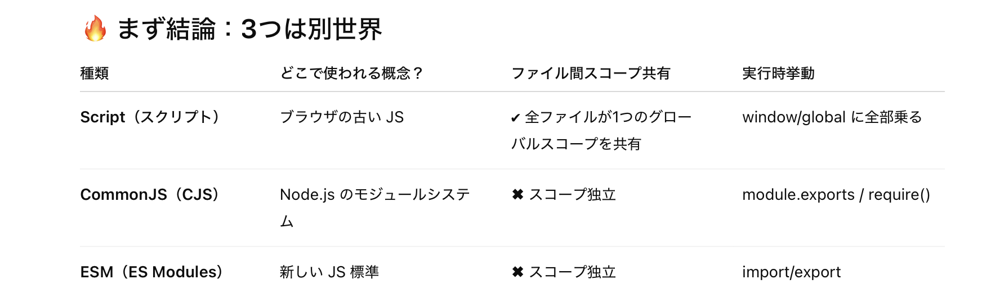

### tsconfig.json の moduleDetection フィールド

- tsc コンパイラがファイルをスクリプトかモジュールのどちらかであるかを判断するかの設定項目

    - tsc 型チェック/コンパイルや IDE 上での静的方チェックの時影響する

    - ★ランタイム (ブラウザやNode.js) では一切影響しない

<br>

- 設定値は以下の3つ

    - #### auto (デフォルト)

        - 基本的に [legacy](#legacy) と同じく ファイル中に import か export があればモジュールと判断する

            

        <br>

        - ★[module](./tsconfig_moudle.md) が node 系で node 16 以上の場合、 import/export に加えて package.json の type フィールドも判断材料に加える

            - package.json の type フィールドに `module` と指定されいる場合、import/export がないファイルもモジュールと判断される

                

            <br>

            - package.json の type フィールドに `commonjs` と指定されいる場合、import/export がないファイルはスクリプトと判断される

                

    <br>

    - #### legacy

        - ファイル中に import か export があればモジュール、そうでなければスクリプトとして扱う

            

    <br>

    - #### force


        - 全てのファイルをモジュールとして扱う

            - ファイル中にグローバルな関数/オブジェクト/変数の宣言自体は可能だが、他のファイルから直接参照できなくなる

                

            <br>

            - コンパイル後は全ての js ファイルがモジュールになるようコンパイルされる

                
                
<br>
<br>

参考サイト

[tsconfig.json の moduleDetection](https://zenn.dev/hayato94087/articles/30bda5f837be74)

[TypeScript4.5以降で追加されたTSConfigのオプションを調べてみた](https://t-yng.jp/post/typescript-tsconfig-options-over-4.5)

[TypeScript モジュール](https://www.webdesignleaves.com/pr/jquery/typescript-basic-05.html#h3_index_16)

[TypeScript - Module Detection](https://www.typescriptlang.org/ja/tsconfig/#moduleDetection)

---

### スクリプトとモジュールのグローバルスコープ



- #### スクリプト

    - HTML に埋め込む JavaScript 

    - スクリプトファイルのトップレベルで宣言した関数/オブジェクト/変数はグローバルスコープとなり、**他のファイルからでも参照可能**

<br>

- #### モジュール

    - Common JS

        - 、Node.js などのサーバーサイド環境でJavaScriptを扱うためのモジュール（部品化されたコード）の仕様

        - require/modules.exports でモジュールの読み込みや公開をする

        - モジュール (ファイル) のトップレベルで宣言した関数/オブジェク/変数は**そのモジュール内であればどこからでも参照可能だが、他のファイルからは参照できない**

    <br>

    - ES Modules

        - ECMA Script に従ったモジュールの仕様

        - import/export でモジュールの読み込みや公開をする

        - モジュール (ファイル) のトップレベルで宣言した関数/オブジェク/変数は**そのモジュール内であればどこからでも参照可能だが、他のファイルからは参照できない**

<br>

#### 注意点

- ★CJS でも EMS でも、モジュールのトップレベル変数/関数/オブジェクトを宣言してもグローバルスコープに属さない

    - Node.js で動くモジュールにてグローバルスコープに変数/関数/オブジェクトを追加したい場合は、`global` オブジェクトに追加する

        ```js
        //index.js
        global.myval = "Hello World";
        ```
    
        ```js
        //modA.js
        console.log(global.myval);
        //"Hello World"
        ```

    <br>

    - ブラウザで動くモジュールにてグローバルスコープに変数/関数/オブジェクトを追加したい場合は、`window` オブジェクトに追加する

        ```js
        //index.js
        window.myfunc = (name) => {
            return `Hello ${name}`;
        }
        ```

        ```js
        //modA.js
        console.log(window.myfunc("Andy"));
        //"Hello Andy"
        ```
        
<br>
<br>

参考サイト

[TypeScript モジュール](https://www.webdesignleaves.com/pr/jquery/typescript-basic-05.html#h3_index_16)
