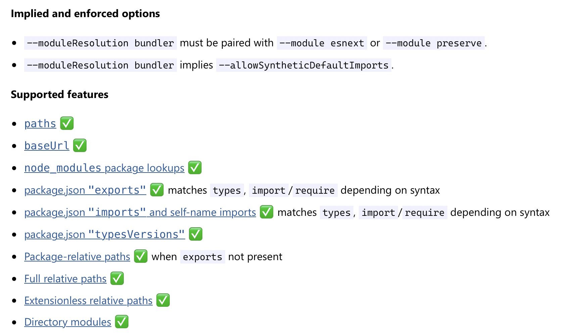
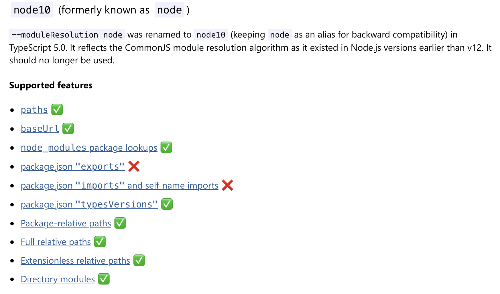
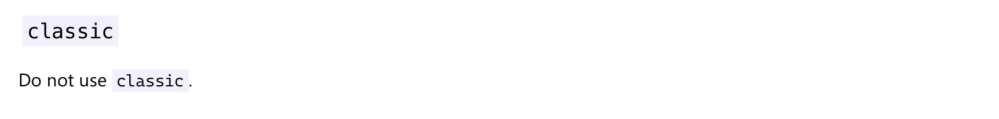
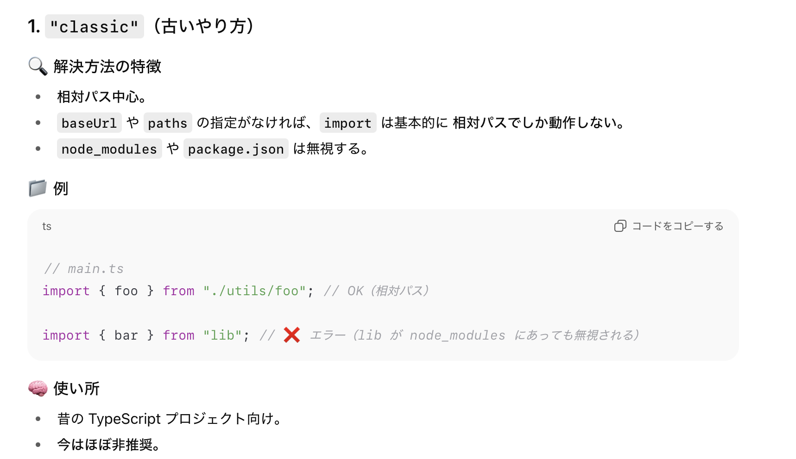

### tsconfig の moduleResolution とは

- TypeScript におけるモジュールの解決方法（import 先ファイルの探索ルール）を指定するオプション

    

<br>

- ★moduleResolution は実行時のモジュール解決ではなく、**IDE での静的解析や tsc でのコンパイル時のモジュール解決**に関する設定項目であることに注意

    - 実行時のモジュール解決は Node.js やバンドラーが行う

    <br>

    - ★★**tsc 以外のコンパイラを使う場合**、 moduleResolution をはじめとした設定項目は基本的にコンパイル~ビルド時の挙動に影響しない

        - ★★★**tsc 以外のコンパイラを使う場合でも** tsconfig は VSCode などの IDE での補完や型エラー表示に使われる

<br>

- moduleResolution に設定できる値は `node16 (nodenext)`, `bundler`, `node10(node)`, `classic` の4つ (2025年時点)

<br>

- tsconfig にて [module](./tsconfig_moudle.md) のみを指定する場合、その設定値に対応する moduleResolution の値が裏で自動的に設定されるが、逆に moduleResolution のみを指定する場合は **module は自動的に設定されないことに注意**
 
    → 例: module を nodenext にすると、moduleResolution も自動的に nodenextになるが、 moduleResolution を nodenext にしても module は自動的に nodenext にならず、明示的に module に nodenext を指定する必要がある

    - 詳しくは [moduleResolution のデフォルト値](#moduleresolution-のデフォルト値) を参照

<br>
<br>

参考サイト

[TypeScript Compiler Options](https://www.typescriptlang.org/tsconfig/#moduleResolution)

[moduleResolution](https://zenn.dev/hayato94087/books/b174f8b1cd80db/viewer/v00-05-07-ap62cfd067ir#moduleresolution-とは❓%EF%B8%8F)

[モジュールバンドラって何？次世代Webpackが切り開くフロントエンド開発の新時代✨](https://zenn.dev/cy_knix/articles/8f198ef2cf7210)

[TypeScriptで"moduleResolution": "Node"は使わないほうがいい](https://blog.s2n.tech/posts/dont-use-moduleresolution-node/)

---

### node16 (nodenext)


引用: [Modules - Reference](https://www.typescriptlang.org/docs/handbook/modules/reference.html?utm_source=chatgpt.com#node16-nodenext)

<br>

- ★いわゆる [Node.js V12 以降のモジュール解決 (CommonJSとESMの両方をサポートする)](./モジュール解決.md#es-moudles-のモジュール解決) を模倣した形になる

<br>

- ★moduleResolution に nodenext を指定する場合、module は node16, node18, node20, nodenext (要するに node16 以上) を設定しなければならない

<br>

- nodenext は最新の node\~\~ のエイリアス (module の nodenext や esnext と同じ)

    - 2025年時点では nodenext は node16 を指す

<br>

- ★ts ファイルのコンパイル結果が ECMAScript か CommonJS かによってサポートされる機能が異なる => ts ファイルの書き方 (主に import) が異なってくる

    - コンパイル結果が ECMAScript となる ts ファイルの場合、**拡張子を省略した import やローカルディレクトリを指定した import はできない**

        ```ts
        //lib.ts
        export const greeting = "Hello";

        ----

        // main.mts

        //↓拡張子を省略したimportはできない
        import { greeting } from './lib'; //×
        import { greeting } from './lib.js'; //○

        //ローカルディレクトリを指定したimportはできない
        import * as A from './dir'; //×
        import * as A from './dir/index.js'; //○ (ディレクトリ内の対象ファイルまで指定する必要がある)
        ```

        <br>

        - ★コンパイル結果が ECMAScript となるケースは以下の通り

            1. ファイル拡張子が `.ts`　で package.json の type フィールドに module が指定されている

            2. またはファイル拡張子が `.mts`

    <br>

    - コンパイル結果が Common JS となる ts ファイルの場合、拡張子を省略した import やローカルディレクトリを指定した import が可能

        ```ts
        //./lib/index.ts
        export const greeting = "Hello";

        ---

        // main.cts

        //↓拡張子を省略したimportが可能
        import { greeting } from './lib/index'; //○
        //↓拡張子を指定したimportもOK
        import { greeting } from './lib/index.js'; //○

        //ローカルディレクトリを指定したimportも可能
        import * as A from './lib'; //○
        ```

        <br>

        - ★コンパイル結果が Common JS となるケースは以下の通り

            1. ファイル拡張子が `.ts`　で package.json の type フィールドに commonjs が指定されている

            2. またはファイル拡張子が `.cts`

---

### bundler



引用: [Modules - Reference](https://www.typescriptlang.org/docs/handbook/modules/reference.html?utm_source=chatgpt.com#bundler)

<br>

- "bundler" モードは、その名の通り、バンドラ（例：Webpack、Rollup、Vite など）を使って最終的にモジュールを結合 / バンドルする環境 を前提としたケースに利用される

    - TypeScript 5.x で導入された新しいモジュール解決モード 

    - ★★★具体的には、バンドラで利用される tsc 以外のコンパイラのモジュール解決の動きを模倣するオプション★★★

<br>

- ★イメージとしては、**[nodenext](#node16-nodenext) とほとんど変わらない**が、`.mts` ファイル中の import にて拡張子の省略などが許容されるのが bundler (コンパイ結果がうまく動くかどうかは別)

<br>

- ★moduleResolution に nodenext を指定する場合、module は esnext か preserve を設定しなければならない

- ★moduleResolution に nodenext を指定する場合、module は node16, node18, node20, nodenext (要するに node16 以上) を設定しなければならない

<br>

#### 重要な考え方

- なぜ他のコンパイラやモジュールバンドラを利用する場合に、moduleResolution に bundler を指定するのか?

    - moduleResolution: bundler を設定すると、IDE 上での静的解析•型チェックの挙動 (+tsc でのコンパイルの挙動) が多くの JS バンドラーでサポートされている挙動になる

        → ★IDE 上での静的解析•型チェックの挙動を他のコンパイラやモジュールバンドラに合わせることで、**開発時の型チェック・補完のエラーを減らすため (IDE上でのエラーとコンパイル時のエラーが一致するようにするため)**

<br>

- ちなみに、moduleResolution に bundler と指定しても、tsc でコンパイルすること自体は可能

    - tsc でのモジュール解決が、 Vite などのコンパイラ (esbuild) を模倣した動きになるだけ

    - ★逆に他のコンパイラを利用しているケースで、moduleResolution に nodenext を指定したとて、**tsc 以外のコンパイラは tsconfig の設定に影響を受けない**ため意味ない

---

### node10 (node)



引用: [Modules - Reference](https://www.typescriptlang.org/docs/handbook/modules/reference.html?utm_source=chatgpt.com#node10-formerly-known-as-node)

<br>

- Node.js 10 以前のモジュール解決法

<br>

- ★いわゆる [Common JS でのモジュール解決方法](./モジュール解決.md#nodejs-esm-未サポートバージョン)を模倣した形になる

<br>

- ★package.json の exports / imports フィールドをサポートしない

    - exports / imports フィールドに関しては[こちらの記事](https://shisama.hatenablog.com/entry/2020/12/21/090000)がわかりやすい
   
    

---

### classic



引用: [Modules - Reference](https://www.typescriptlang.org/docs/handbook/modules/reference.html?utm_source=chatgpt.com#classic)

<br>



<br>

- TypeScript 1.6 以前で使用されていたモジュールの解決法

    - node_modules をサポートしていないので node_modules 配下のパッケージ名に対し、パッケージ名のみを指定する import が使えない

<br>

- ★classic はほぼ使わないので、無視していい

---

### 誤解&疑問

#### 誤解1

- `"moduleResolution": "node"` に設定したからと言って、コンパイル結果のモジュールシステムが Common JS になるわけではない

    - コンパイル結果のモジュールシステム Common JS になるのは以下のとき

        1. ファイル拡張子が `.ts` で package.json の type フィールドが commonjs の時

        2. ファイル拡張子が `.cts` の時

    <br>

    - moduleResolution がコンパイル結果のモジュールシステム (require & module.exports / import & export) を決めるわけではなく、**tsconfig の module フィールド や ファイル拡張子、 package.json の type フィールドによって決定される**

<br>

#### 疑問1

- `"moduleResolution": "nodenext"` と設定した場合、ts ファイルの import の対象はなぜ `.js`?

    ```js
    //./lib/index.ts
    export const greeting = "Hello";

    ---

    // main.ts
    import { greeting } from './lib/index.ts'; //×
    import { greeting } from './lib/index.js'; //○
    ```

    

    引用: [Compiler Options- Module Resolution](https://www.typescriptlang.org/tsconfig/#moduleResolution)

    <br>

    - tsc はコンパイル時に import 対象の `.ts` を `.js` に変換することはしない

        - つまり、自分でコンパイル結果を見通して import 対象を指定する必要がある

        - ★しかし、tsconfig.json の[ `allowImportingTsExtensions`](./tsconfig_allowImportingTsExtensions.md),[`rewriteRelativeImportExtensions`](./tsconfig_rewriteRelativeImportExtensions.md) を有効にすることで、**.ts ファイルを指定した import ができるようになった**

            

            <br>

            

<br>
<br>

参考サイト

[Node.js v23.6.0：TypeScriptサポートが登場](https://note.com/leapcell/n/n87c87d6f2414)

[TypeScript imitates the host’s module resolution, but with types](https://www.typescriptlang.org/docs/handbook/modules/theory.html?utm_source=chatgpt.com#typescript-imitates-the-hosts-module-resolution-but-with-types)

---

### moduleResolution のデフォルト値


引用: [Compiler Options- Module Resolution](https://www.typescriptlang.org/tsconfig/#moduleResolution)

- moduleResolution のデフォルト値は module に依存する

    - 基本的には classic

    - module が CommonJS の場合、moduleResolution は node10 (node)

    - module が node16, node18, node20 の場合、moduleResolution は node16

    - module が nodenext の場合、moduleResolution は nodenext

    - module が preserve の場合、moduleResolution は bundler

<br>
<br>

参考サイト

[Compiler Options- Module Resolution](https://www.typescriptlang.org/tsconfig/#moduleResolution)