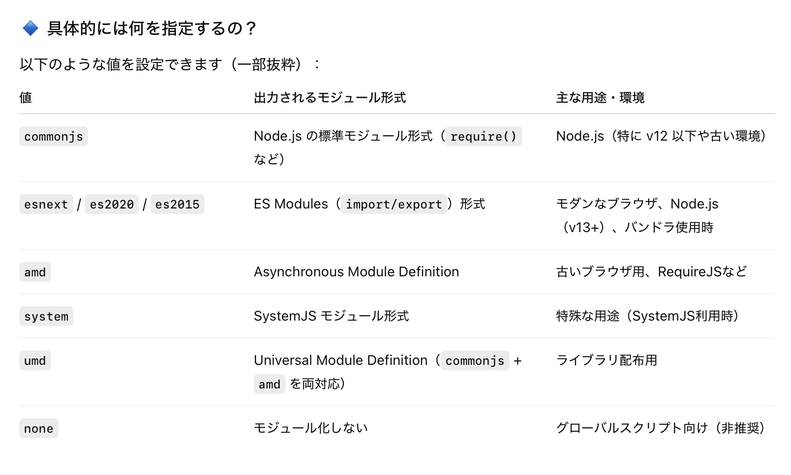
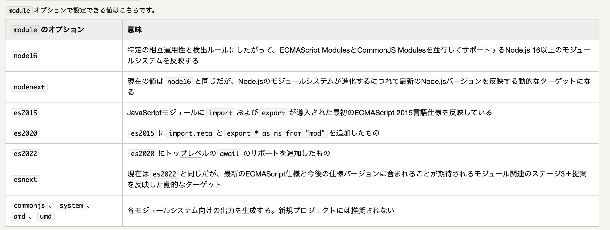

### tscofig の module とは

- TypeScript を JavaScript にコンパイルする際に、どのモジュールシステムで出力するかを決める項目

    

 

- `commonjs`、`es2015` の他にさまざま設定値がある

    

     

    

    引用: [TypeScript × Node.jsでECMAScript Modulesを試す](https://kazuhira-r.hatenablog.com/entry/2024/08/10/234305)

     

    - `es~~` でも指定するモジュール形式によって、サポートされる機能が異なってくることに注意 (`node~~` でも同様)

        - 例: tsconfig の module に `es2015` を指定した場合、top-level await を使うとコンパイルエラーになる (es2015 では top-level await がサポートされていないから)

     

    - ★`~~next` と言う設定値は、その系統のモジュールシステムの最新バージョンを指すらしい

        - `nodenext` は最新の `node~~` (node20とか) を指す

            - Node.js のモジュールシステムとは? CommonJS と違うの?

                → ★★Node.js はバージョン14以降 CommonJS と ECMAScript の両方をサポートするようになったため、`node~` や `nodenext` を指定すると**TypeScript は Node.js の最新のモジュール形式（ESM + CommonJS のハイブリッド）をサポートする**

                →「TypeScript は Node.js の最新のモジュール形式（ESM + CommonJS のハイブリッド）をサポートする」とは、`.ts` ソースコードから、ESM 用と CommonJS 用の出力をそれぞれビルドできる機能

         

        - `esnext` は最新の `es~~` (ES2022とか) を指す

 
 

参考サイト

[TypeScriptのmoduleオプションの話、あるいはTypeScript開発者の苦悩、あるいはCJSとESMの話](https://zenn.dev/uhyo/articles/typescript-module-option)

[tsconfig.jsonを設定する](https://typescriptbook.jp/reference/tsconfig/tsconfig.json-settings#module)

[module](https://zenn.dev/hayato94087/books/b174f8b1cd80db/viewer/v00-05-06-bui6xserv4h1)

[TypeScript × Node.jsでECMAScript Modulesを試す](https://kazuhira-r.hatenablog.com/entry/2024/08/10/234305)

---

### Node.js のモジュールシステム

- Node.js v14 以前は、Common JS が Node.js のベースとなるモジュールシステムだった

    - ★★しかし、Node.js v14 から ES Module モジュールシステムもサポートされ、今では Node.js は両方のモジュールシステムを利用することができる

    

     

    - Node.js のモジュールシステムは以下のように解決される

        - ファイル拡張子が `.cjs` のものは CommonJS のモジュールシステムを利用したものと認識される

         
        
        - ファイル拡張子が `.mjs` のものは ES Moudle のモジュールシステムを利用したものと認識される

         

        - ファイル拡張子が `.js` のものは package.json の type フィールドで指定されたものとして認識される

            - 詳しくは[こちら](./ESModuleとCommonJS.md#nodejs-のモジュールシステム)を参照

 

#### ES\~\~ (ES6 など) って何?

- JavaScript の標準規格 (=文法) である ECMA Script の各バージョンを指す

    - ★ES6 や ES12 のように1桁とか2桁で表されるのは**通称**であり、正式名称は ES2015 や ES2021 のように年で表される

     

    - ★ES6 以降、毎年新しいバージョンがリリースされており、それらを年号で呼ぶことが一般的

    

 

#### ES\~ と CommonJS の関係

- ES\~ は ECMA Script のバージョンを表すものなので、CommonJS と特に関係はない

 

#### ES\~ と Node.js の関係

- Node.js はバージョン14以降 ECMA Moudle もサポートするようになったので、大いに関係あり

---

### 疑問

1. module はコンパイル結果の JavaScript のモジュールフォーマットを指定する項目なのになぜ node16, node18, node20 や es2015, es6, es2020, es2022 のように、**同じモジュールシステムなのに色々なバージョンが指定できるのか**?

    - A: Node.js や ECMA Script において特定バージョン依存の違いがあるかららしい

        = モジュールシステムの基本構文 (import/export や require/module.exports) については違いはないが、**バージョンごとのモジュール周辺の仕様変更や追加機能の差によって、出力されるコードが違ってくる**ため es系でも es2015, es6, es2020, es2022 のように複数バージョン用意されている

        

         

        

---

### module のデフォルト値

引用: [Compiler Options - Module](https://www.typescriptlang.org/tsconfig/#module)

 

- module のデフォルト値は target に依存する

    - 基本的には ES6 / ES2015 (ES6 と ES2015 は同じ)

    - target が CommonJS の時は module のデフォルト値は ES5 になる

 
 

参考サイト

[Compiler Options - Module](https://www.typescriptlang.org/tsconfig/#module)