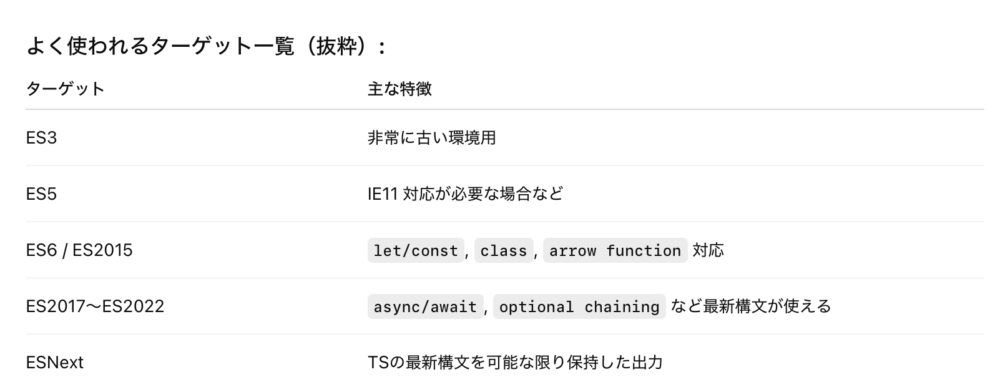
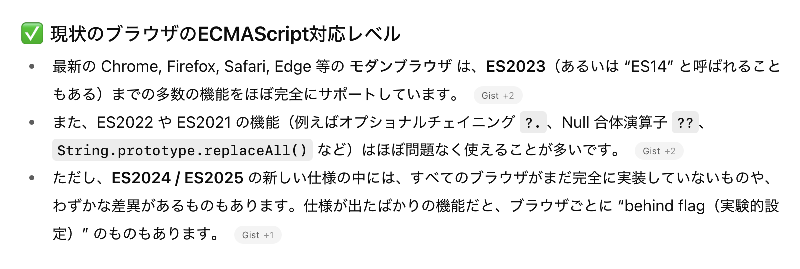

### tsconfig.json のcompileOptions の target とは

- `target` は「どのバージョンの JavaScript に変換するか」を指定するプロパティ

    - 一方、`module` は「どのモジュール形式でコンパイル&出力するか」を指定するプロパティ

 

- ★JavaScript の文法 (モジュールシステムを除く) をどのバージョンとしてコンパイルするかを指定するプロパティ

    - tsconfig の `target` は モジュールシステム（CommonJS, ESModulesなど）には影響を与えない

    - モジュールの形式は tsconfig の `module` によって制御される

---

### target の設定値

---

### ブラウザで動かす場合の target の設定値はどれがいい?

- 多くのブラウザは ES2023 (ES14) までの機能をほぼサポートしている

    

 
 

参考サイト

[ECMAScript Support (as of October 29, 2022)](https://gist.github.com/Julien-Marcou/156b19aea4704e1d2f48adafc6e2acbf?utm_source=chatgpt.com#browser-usage)