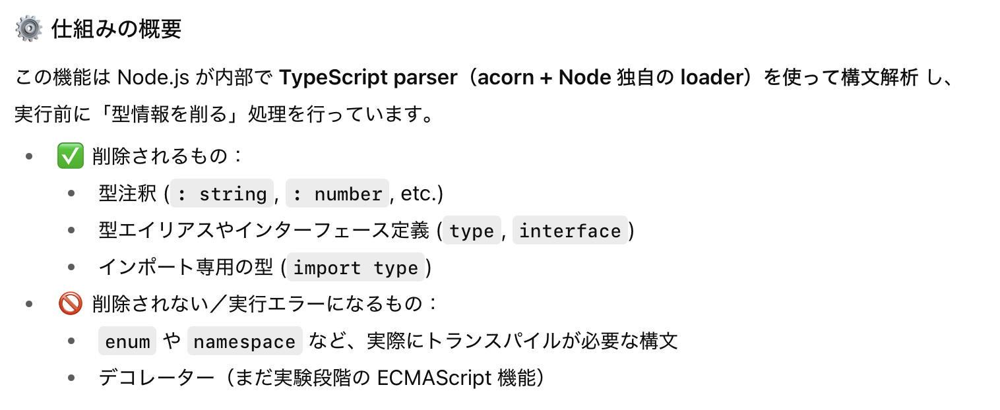

### ts ファイルの実行方法

- 様々な TypeScript ファイルの実行方法がある

    #### 1. TypeSciprt → JavaScrtip にコンパイルし、 JavaScript を実行する
    
    - 今回は tsc というモコンパイラを使ってみる

        - ★もっと正確に言うと、typescript パッケージにコンパイラがあり、tsc はそのコンパイラの API を呼び出す CLI のプログラム
    
    <br>

    - typescript パッケージをインストール (typescript をインポートすると tsc もインストールされる)

        ```bash
        npm install -D typescript
        ```
    
    <br>

    - 作成した ts ファイルを js ファイルにコンパイルし、js ファイルを実行

        ```bash
        #package.json の scripts に定義してもいい
        #tsファイルのコンパイル
        npx tsc <tsファイル>

        #コンパイルされたjsファイルの実行
        node <jsファイル>
        ```
    
    <br>
    <br>

    #### 2. ts-node や tsx などのランタイムから実行する

    - typescript のインストール

        - ★ts-node や tsx も結局は内部で TypeScript → JavaScript にコンパイルして node 上で実行しているから、**コンパイラが必要**

        ```bash
        npm install -D typescript
        ```
    
    <br>

    - ts-node のインストール

        ```bash
        npm install -D ts-node
        ```

    <br>

    - ts-node で ts ファイルの実行

        - package.json の scripts に記述する場合

            ```json
            #package.json
            #index.tsを実行すると想定
            {
                "scripts": {
                    "exec": "ts-node index.ts"
                },
            }
            ```

            ```bash
            npm run exec

            #scritpsのexecにts-nodeだけを記述した場合、実行対象のファイル名を引数として渡すことも可能
            npm run exec -- ./index.ts
            ```
        
        <br>

        - npx で実行する場合

            ```bash
            #index.tsを実行すると想定
            npx ts-node index.js
            ```

        <br>
        <br>

        #### 3. Node.js から ts ファイルを直接実行することも可能

        - 詳しくは[こちら](#nodejs-から-ts-ファイルを直接実行する)を参照

<br>
<br>

参考サイト

[サバイバルTypeScript 簡単な関数を作ってみよう](https://typescriptbook.jp/tutorials/make-a-simple-function-via-cli#コンパイルを通す)

[ローカル環境でTypeScriptを実行する手順](https://zenn.dev/zaruta/articles/d453ca6d3bed88)

[ts-node](https://www.npmjs.com/package/ts-node#installation)

---

### Node.js から ts ファイルを直接実行する

- Node.js v23.6.0 から .ts ファイルを直接実行できるようになった

    ```bash
    #事前準備
    mkdir my-node
    cd my-node
    npm init -y

    #tsファイルを作成
    echo -e "const msg: string = 'hello';\nconsole.log(msg);" >> index.ts

    #tsファイルを指定してコンパイルなしで直接実行
    node index.ts
    #結果->hello
    ```

<br>

#### 具体的な仕組み

- × Node.js にTypeScriptのコンパイル機能が組み込まれた?

- ○ Node.js の strip-types 機能が ts ファイルの直接実行を実現している

    - strip-types 機能はざっくり説明すると、**ts ファイルから型情報を取り除いて実行する機能**

    - つまり、Node.js v23.6.0 から type‐stripping がデフォルトで有効になったため、Node.js v23.6.0 から .ts ファイルを直接実行できるようになった

    

<br>

#### 注意点

- ★型チェックが一切行われない
    
    ```js
    let msg: string = 'hello';
    msg = 100; //★ここでエラーが出ない
    console.log(msg);
    //>100
    ```

    - ★「タイプチェックが働くことでプログラムの欠陥に早い段階で気づくことができる」という TypeScript で開発する際の利点が無くなる

<br>

- ★enum や namespace など、実際にトランスパイル(コンパイル)が必要な構文を使っていると実行エラーが発生する

    

<br>
<br>

参考サイト

[Node.js v23.6.0：TypeScriptサポートが登場](https://note.com/leapcell/n/n87c87d6f2414)

[【Node.js】Built-in TypeScriptへの第一歩　Type Strippingの試験的導入](https://zenn.dev/ma_me/articles/785eaa9933b3a3)