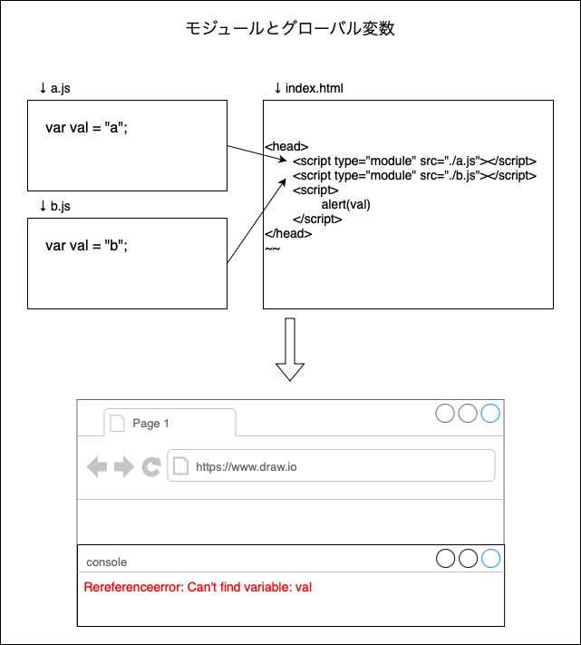
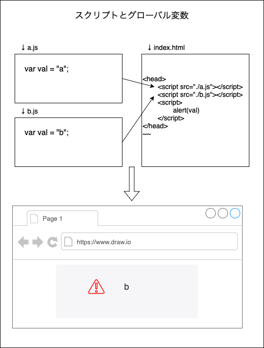

### モジュールとスクリプト

#### モジュール

- JavaScript におけるモジュールとは、export または import を1つ以上含む JavaScript ファイルを指す

    - import しかないファイル、または export しかないファイルもモジュール

 

- トップレベルの var で宣言した変数もグローバル変数にならない

    

 

#### スクリプト

- export / import を含まないファイルを指す

 

- トップレベルで宣言された変数はグローバル変数になる

    - const, let で宣言されていれば、トップレベルで宣言されたとしても変数はグローバル変数にならない

    
    
 
 

参考サイト

[🚧モジュール](https://typescriptbook.jp/reference/modules)

[import、export、require](https://typescriptbook.jp/reference/import-export-require)

---

### モジュールシステム

- コードを分割・再利用・管理するための仕組み

- JavaScript では少なくとも2つ以上のモジュールシステムが混在している

 

#### CommonJS

- `require` キーワードで他のファイルを読み込む

 

- `module.exports` キーワードでモジュールを他のファイルからも読み込めるようにする

 

#### ES Modules

- ES6（2015年）で公式に仕様として導入されたモジュールシステム

    - それまでの JavaScript ではモジュールという概念がなく、複数 JS ファイルで構成された Web サイトにおいて、グローバル変数の名前管理などが大変だったらしい

 

- `import` キーワードで他のファイルを読み込む

- `export` キーワードでモジュールを他のファイルからも読み込めるようにする