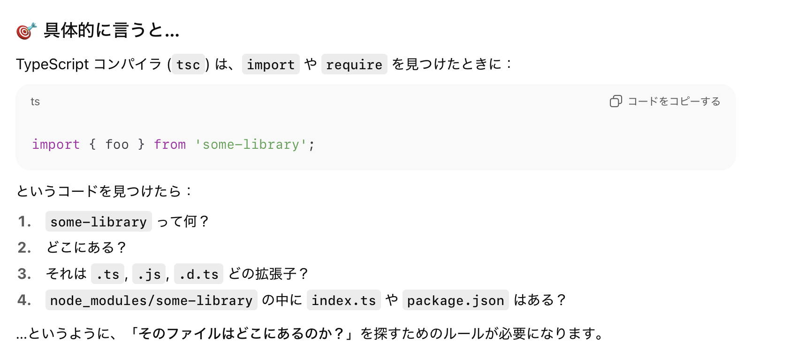
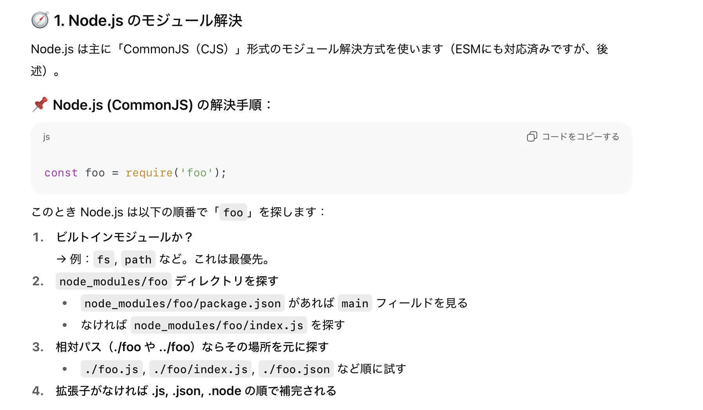

### モジュールの解決とは

- import 先ファイルの探索ルール

    - import で指定されたファイルをどのようにして探すか

    

---

### Common JS (Node.js v12 より前) のモジュール解決



<br>

- ★インポート先として、個別のファイルやディレクトリを指定可能

    - ★★ファイルを指定する場合でも、**ファイル拡張子の省略が可能**

        ```js
        // my-lib.js
        module.exports.Human = class Human {
            constructor(name) {
                this._name = name;
            }
        }

        ---

        // index.js
        const human = require('./my-lib'); // ★ここ
        ```

    <br>

    - ★★一方で、ファイル拡張子付きでインポートすることも可能

        ```js
        // my-lib.js
        module.exports.Human = class Human {
            constructor(name) {
                this._name = name;
            }
        }

        ---

        // index.js
        const human = require('./my-lib.js'); // ★ここ
        ```

    <br>

    - ★★ import 対象として指定するのがディレクトリの場合、

        1. 指定されたディレクトリにある package.json の main フィールドに指定されているエントリーポイントを読み込もうとする

        <br>

        2. ↑ の package.json や main フィールドが無ければ、指定されたディレクトリの index.js を読み込む

        <br>

        3. ↑ の index.js も無ければ .node などの他の拡張子がついたファイル (`index.json` や `index.node` など)

            - ★★★Node.js (CommonJS) は require で json ファイルを読み込むことができる (裏で自動的に fs モジュールが使われ、読みkみ結果が読みkみ結果が JSON.parse() でパースされる)

            <br>

            - ★★★.node という拡張子のファイルは、超ざっくり説明するとバイナリファイル (OS 機能の利用が主な目的)


                

<br>

- 具体的なモジュールの解決プロセスは以下の通り

    

    <br>

    - ★相対パスでディレクトリが指定されたときも同じプロセスでモジュールの解決が行われる

---

### ES Moudles のモジュール解決

#### そもそもESM (ECMAScript Modules とは)

- ECMA Script 標準のモジュールシステム

<br>

#### ESM のモジュール解決の特徴


<br>

- ★相対パスで import する際は拡張子が必要

    - ★★Common JS のようにディレクトリをインポート (その中の index.js やpackage.json の main に指定されているファイル) することはできない

<br>

- node_modules 配下のパッケージを指定する場合は拡張子はいらない

    - Common JS のように、**指定されたパッケージ内の index.js や package.json で指定されているファイルをエントリーポイントとして読み込む**


    - ★しかし、package.json の [`exports`](#packagejson-の-exports-とは) という項目が ESM では有効になる

<br>
<br>

参考サイト

[Node.js v24.10.0 documentation - import Specifiers](https://nodejs.org/api/esm.html#esm_package_json_type_field)

---

### Node.js (Node.js v12 以降) のモジュール解決

- Common JS と ESM の両方をサポートするようになった

<br>

- ★ファイル拡張子や package.json の type フィールドの設定値によって、どのファイルを Common JS、どのファイルを ESM として扱うかが決まる

    - `.js` ファイルの場合、package.json の type によって扱われ方が変わる

        - type フィールドに module が設定されていれば、`.js` ファイルは ESM として扱われる

            → import/export でモジュールの解決を行う
            
            ```json
            //pcakage.json

            {
                "type": "module"
            }
            ```

            ```js
            //my-lib.js
            export const myval = "hello";

            ---

            //index.js
            import { myval } from "./my-lib.js"; //index.jsはESMとして扱われるので、importの対象の拡張子は必須

            console.log(myval);
            ```

        <br>

        - type フィールドに commonjs が設定されていれば、`.js` ファイルは Common JS として扱われる

            → require/moudle.exports でモジュールの解決を行う

            ```json
            {
                "type": "commonjs"
            }
            ```

            ```js
            //my-lib.js
            module.exports.myval = "hello";

            ---

            //index.js
            const mylib = require("./my-lib");
            console.log(mylib.myval);
            ```

    <br>

    - `.mjs` ファイルの場合、ESM として扱われる

        ```js
        //my-lib.mjs
        export const myval = "hello";

        ---

        //index.mjs
        import { myval } from "./my-lib.mjs"; //my-libはESMとして扱うので拡張子が必須

        console.log(myval);
        ```

    <br>

    - `.cjs` ファイルの場合、Common JS として扱われる

        ```js
        //my-lib.cjs
        module.exports.myval = "hello";

        ---

        //index.cjs
        const mylib = require("./my-lib"); //my-libはCJSとして扱うので拡張子は省略可

        console.log(mylib.myval);
        ```

<br>

- ★ESM から Common JS ファイルを読み込む場合は、ESMを読み込むように import で CommonJS を読み込むことができる

    ```js
    //lib.cjs (Common JS ファイル)
    module.exports.greeting = "Hello";
    
    ---

    //main.msj (ESM ファイル)
    import { greeting } from "./lib.cjs"
    ```

<br>

#### Common JS と ESModules の連携

- ★★ESM ファイルから Common JS ファイルを読み取るには、通常の ESM の import と同じ

    ```js
    //my-lib.cjs
    module.exoprts.myval = "hello";

    ---

    //index.mjs
    import { myval } from "./my-lib.cjs"; //ESMからCJSを読み込む

    console.log(myval)
    ```

<br>

- ★★Common JS ファイルから ESM ファイルを読み取るには**動的 import** を利用する必要がある

    - ★★★Node.js 13.2.0 から Common JS での動的 import がサポートされたらしい

    - ★★★動的 import では**原則として拡張子の明記が必須**

    ```js
    //my-lib.msj
    export myval = "hello";

    ---

    //index.cjs
    async function mylib() {
        const myval = await import("./my-lib.mjs"); //拡張子付きで対象を指定
        return myval;
    };

    mylib().then((result) => {
        console.log(result);
        // → { myval: 'hello' }
    })
    ```

<br>
<br>

参考サイト

[Node.jsのモジュールタイプごとの読み込み方法](https://zenn.dev/monicle/articles/06362e143950c5?utm_source=chatgpt.com)

[CommonJS環境でESModulesをどうしても動かしたい時](https://zenn.dev/cureapp/articles/73dfc01302afbb)

---

### TypeScritp のモジュール解決

- ★ [tsconfig の moduleResolution](./tsconfig_moudleとmoduleResolution.md#tsconfig-の-moduleresolution-とは) で ts ファイル → js ファイルコンパイル (+IDE 上での静的チェック) 時のモジュール解決法を設定できる

    - ★★ コンパイル済みの js ファイルを実行する際のモジュール解決については、Node.js やバンドラーが行う

---

### Package.json の exports とは

- ざっくり説明すると、「外部に公開するエントリーポイント」 ≒ package.json の main フィールドを複数設定できるイメージ

    

<br>

- ★ Common JS では exports フィールドは無視される

<br>

- ★ ESM では exports は main よりも優先され、exports がない場合に main がフォールバック的に機能する

<br>
<br>

参考サイト

[package.jsonのexportsフィールドについて](https://zenn.dev/makotot/articles/5edb504ef7d2e6)

[package.json の imports / exports フィールド](https://shisama.hatenablog.com/entry/2020/12/21/090000)

[package.jsonのexportsフィールドを設定する(TypeScript)](https://skysan87.hatenablog.com/entry/2023/06/06/013501)

---

### 疑問

- Node.js v12 以降で、ESM を利用したディレクトリインポートは可能か?

    - A: ローカルディレクトリを相対パスで import するのは無理

<br>

- Node.js v12 以降で、Common JS は package.json の expors フィールドを利用可能か?

    - A: 無理 Common JS は main フィールドのみを参照