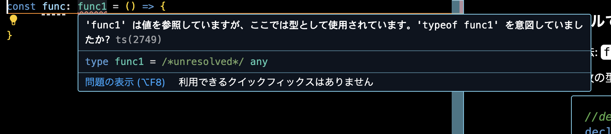

### 型定義ファイルで関数を定義する

- #### ダメな方法: function キーワードを使う

    - 関数の型定義ではなく、関数の宣言になってしまう

        ```ts
        //decalre版
        declare function func1(val: string): string;

        //export版
        export function func2(val: number): number;

        //namespace版
        declare namespace MyType {
            export function func3(val: boolean): boolean;
        }
        ```

    <br>

    - 実際に[型アノテーション](./型アノテーション_型推測_型アサーション.md#型アノテーション-type-annotation)で使おうとするとエラー

        

<br>

- #### 正しい方法: type キーワードを使う

    ```ts
    //decalre版
    declare type func1 = (val: string) => string;

    //export版
    export type func2 = (val: number) => number;

    //namespace版
    declare namespace MyType {
        export type func3 = (val: boolean) => boolean;
    }
    ```

<br>
<br>

参考サイト

[サバイバルTypeScript - 関数の型の宣言 (function type declaration)](https://typescriptbook.jp/reference/functions/function-type-declaration)

---

### 関数型を型アノテーションで使う際の注意

-　関数型の型アノテーションを使った宣言時は引数は省略可能

- もちろん関数の実行時は引数は必要

    ```ts
    //index.d.ts
    declare type func1 = (val: string) => string;
    ```

    ```ts
    //main.ts

    //★func1型を型アノテーションとして使う場合、引数は省略できる
    const myFunc: func1 = () => {
        return "Hello"
    }

    //★しかし、実行する際はもちろん引数なしだとエラー
    console.log(func1("World"));
    ```